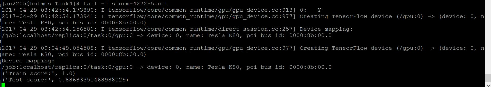

# Using a Pre-trained Convolutional Neural Network (VGG) on the Pet Dataset

Problem: Using Keras Sequential interface, a dedicated GPU cluster and the weights of a pre-trained convolutional neural network (VGG), a linear model is trained on the pets dataset as a feature extraction method.

Approach:  Features are stored on disk so we don't have to recompute them for model selection. This is a 37 class classification task.

Cross-validation score (88%):

  

## Data 
- The raw data can be downloaded from : http://www.robots.ox.ac.uk/~vgg/data/pets/

## Files
- main.py includes all the codes for cleaning the data and models.
